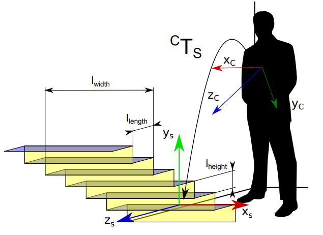
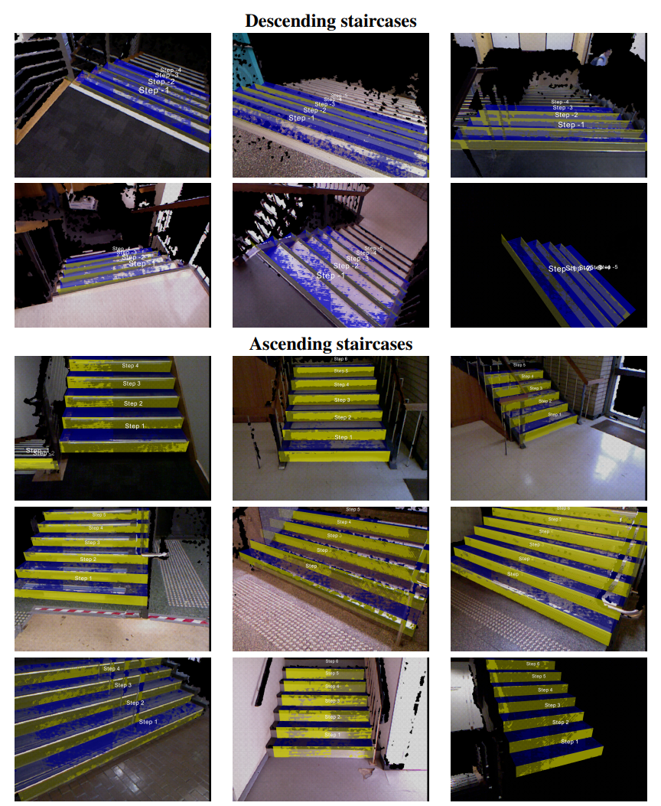

# Stairs detection and modeling with an RGB-D camera
**Authors**: Alejandro Perez-Yus (alperez@unizar.es), Gonzalo Lopez-Nicolas, Josechu Guerrero
University of Zaragoza, Spain

This is the implementation of a method to detect ascending and descending stairs with depth cameras (like Kinect or Asus Xtion) for tasks such as human guidance or robotics. The input of the method can be a single frame or a whole sequence, and besides the detection we recover the pose and dimensions of the staircase.



For more information about the method you may refer to the following **related publications**:
1. Alejandro Perez-Yus, Gonzalo Lopez-Nicolas, Jose J. Guerrero. **Detection and Modelling of Staircases Using a Wearable Depth Sensor**. ECCV 2014 Workshops, Part III, vol. LNCS 8927, no. 3, pp. 449-463, 2015. [PDF](https://zaguan.unizar.es/record/75391/files/texto_completo.pdf)
2. Alejandro Perez-Yus, Daniel Gutierrez-Gomez, Gonzalo Lopez-Nicolas, Jose J. Guerrero. **Stairs detection with odometry-aided traversal from a wearable RGB-D camera**. Computer Vision and Image Understanding, vol. 154, pp. 192-205, 2017. [PDF](http://webdiis.unizar.es/~glopez/papers/Perez-YusCVIU2017.pdf)

Note that [2] is an extension of [1]. This code includes the full implementation of [1] and some features introduced afterwards in [2].

## License

This software is under GNU General Public License Version 3 ([GPLv3](https://www.gnu.org/licenses/gpl-3.0.html)), please see [GNU License](LICENSE)

For commercial purposes, please contact the authors.

License of other dependencies:
- **Eigen3**: For versions greater than 3.1.1 is MPL2, earlier versions are LGPLv3.
- **PCL**: BSD license.

If you use this code in an academic work, please cite:

```
@article{perezyus2014detection,
  title={Detection and Modelling of Staircases Using a Wearable Depth Sensor},
  author={Perez-Yus, A and Lopez-Nicolas, G and Guerrero, J. J.},
  journal={ECCV 2014 Workshops, Part III},
  volume={LNCS 8927},
  year={2015},
  publisher={Springer},
  number={3},
  pages={449--463},
}
```

```
@article{perezyus2017stairs,
  title={Stairs detection with odometry-aided traversal from a wearable {RGB-D} camera},
  author={Perez-Yus, Alejandro and Gutierrez-Gomez, Daniel and Lopez-Nicolas, Gonzalo and Guerrero, J. J.},
  journal={Computer Vision and Image Understanding},
  volume={154},
  pages = {192--205},
  year={2017},
}
```

## Prerequisites
- **OS**: We have tested this code in **Ubuntu 16.04** and **18.04**, but it could work in other versions as well.
- **ROS**: We have tested this code with ROS **Kinetic** (in Ubuntu 16.04) and **Melodic** (in Ubuntu 18.04).

### Installation of prerequisites
Assuming a computer with Ubuntu already installed, to install ROS you may refer to the official website and follow instructions (http://wiki.ros.org/ROS/Installation).

A step by step guide, for ROS Melodic:
- Set up sources.list
```
sudo sh -c 'echo "deb http://packages.ros.org/ros/ubuntu $(lsb_release -sc) main" > /etc/apt/sources.list.d/ros-latest.list'
```
- Set up keys
```
sudo apt-key adv --keyserver hkp://ha.pool.sks-keyservers.net:80 --recv-key 421C365BD9FF1F717815A3895523BAEEB01FA116
```
- Update
```
sudo apt-get update
```
- Install desktop-full version (recommended):
```
sudo apt-get install ros-melodic-desktop-full
```
- Environment setup:
```
echo "source /opt/ros/melodic/setup.bash" >> ~/.bashrc
source ~/.bashrc
```
- To use our data and maybe your own, you will need the ROS OpenNI2 package as well (http://wiki.ros.org/openni2_launch)
``` 
sudo apt-get install ros-melodic-openni2-launch
```

### Configuration of workspace

You may refer to the following the link for more information: http://wiki.ros.org/ROS/Tutorials/InstallingandConfiguringROSEnvironment#Create_a_ROS_Workspace

Step by step:

- Create workspace folder in your home directory (here called `catkin_ws`)
```
$ mkdir -p ~/catkin_ws/src
$ cd ~/catkin_ws/
$ catkin_make
```
- Environment setup:
```
echo "source ~/catkin_ws/devel/setup.bash" >> ~/.bashrc
source ~/.bashrc
```
- Confirm workspace is set up correctly
```
echo $ROS_PACKAGE_PATH
```
you should see something like:
```
/home/user/catkin_ws/src:/opt/ros/melodic/share
```

## Building the Stairs detection and modeling implementation
The packages should be in placed in the `catkin_ws/src` folder (`cd ~/catkin_ws/src` if necessary). If you have your workspace named differently, substitute `catkin_ws` for your workspace name from here on.

To download:
```
git clone https://github.com/aperezyus/stairs_detection.git

```

To compile, go to the workspace folder and do `catkin_make`.
```
cd ~/catkin_ws
catkin_make
```
If you experience any problem with these instructions, please contact us.

## Examples
Our method is able to work with single frames (as point cloud `.pcd` files) or with sequences, either with a camera or by playing a recorded rosbag (http://wiki.ros.org/rosbag)

### Single frame
Here we provide a dataset with some point clouds captured with a Kinect that include 90 positive instances of staircases (ascending and descending) and 58 other scenes with no staircase, to evaluate false positives, negatives, precision or recall, for example; or just for testing the method. 

The dataset was collected by the authors of the following paper. 
- Titus Jia Jie Tang, Wen Lik Dennis Lui, Wai Ho Li. **Plane-Based Detection of Staircases Using Inverse Depth**. Australasian Conference on Robotics and Automation (ACRA), 2012.

Please, cite this work if this dataset is used for academic purposes. From the provided images by these authors (RGB and Depth) we computed the point clouds and thus the .pcd files to be used as input in our method. [DOWNLOAD LINK (.zip, approx. 300mb)](https://drive.google.com/file/d/17KZMbjqmPRpfGGI4l5OGiO17QyANAuwh/view?usp=sharing)

To run a single point cloud, in a terminal:
```
rosrun stairs_detection stairs pcd /complete/path/to/pcdfile.pcd
```
A visualization window of the color point cloud with the staircase model overlaid (in case of positive detection) should appear. Some examples:



To run the whole directory with `*.pcd` files:
```
rosrun stairs_detection stairs dir /complete/path/to/all/pcdfiles/
```
Again, a visualization window should appear for each file. Close the window in order to move on to the next file in the directory.

### Sequence
This implementation is ready to work with a live camera such as a Kinect or an Asus Xtion. For this we use ROS in order to launch the driver and start publishing point clouds in a topic. In particular, you may connect the camera and run in a terminal:
```
roslaunch openni2_launch openni2.launch depth_registration:=true
```
By default it should start publishing point clouds in the topic `/camera/depth_registered/points`. You may visualize that in [RViz](http://wiki.ros.org/rviz)

If this is working, you can just simply run the method and it will automatically use new clouds as input. 
```
rosrun stairs_detection stairs
```
Notice that, in case you use another camera or the camera is publishing in other topic name you will have to change that in the code.

We also provide a recorded sequence so you can test it without using an actual camera. Particularly, we provide a _rosbag_, which actually records the messages published in ROS and thus, by running the rosbag it is exactly the same as using a camera. [DOWNLOAD LINK (.bag, approx. 2gb)](https://drive.google.com/file/d/1e54Qqj3ToIeGIT8QS9G570cPLmGvo0vs/view?usp=sharing)

The rosbag provided only contains RGB and depth images. In order to publish point clouds in `/camera/depth_registered/points`, you need to launch in a terminal:
```
roslaunch openni2_launch openni2.launch depth_registration:=true load_driver:=false
```

And then you can now play the rosbag:
```
rosbag play stairs_home.bag --pause -l -r 0.5
```
Here we have used some optional arguments:
- _--pause_: The rosbag starts paused, you can start/pause playing pressing the space bar, or go frame by frame pressing _s_
- _-l_: The rosbag loops and plays over and over
- _-r 0.5_: The rate the rosbag is playing (e.g. 0.5 means it goes 0.5 times slower)

If you run our method now you should see again an interactive visualization window and the staircases will overlay when they are detected.


